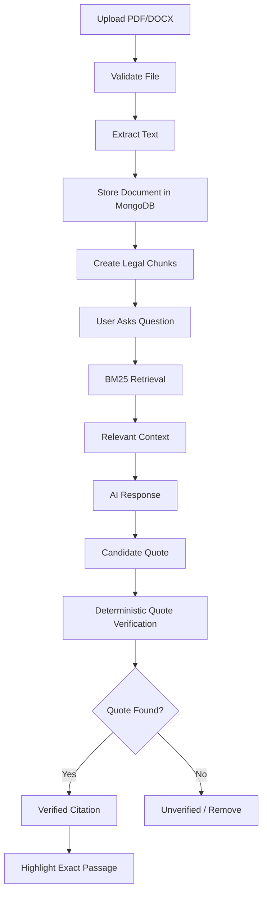
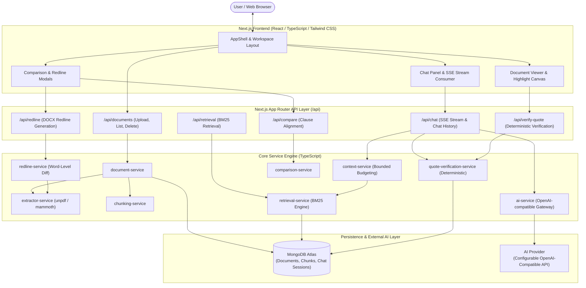
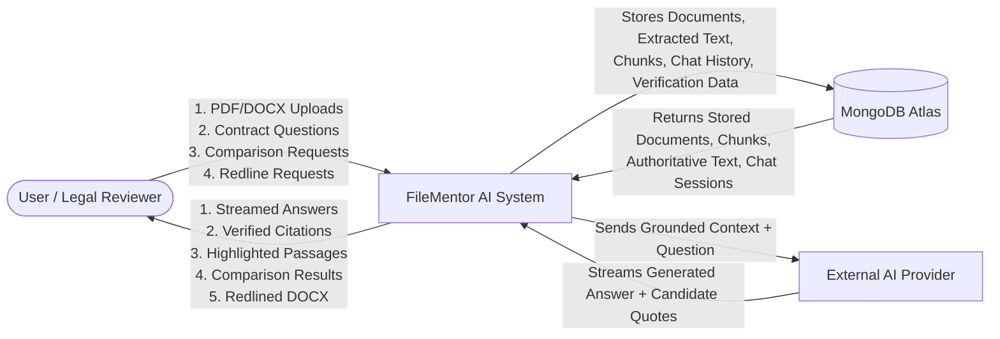
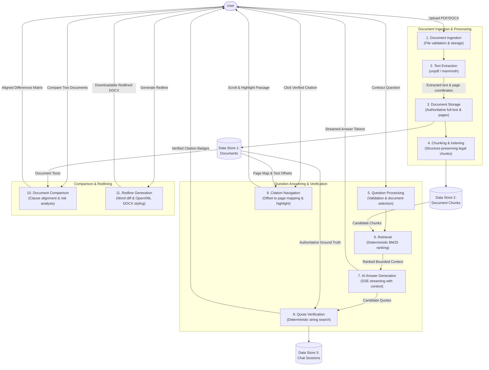
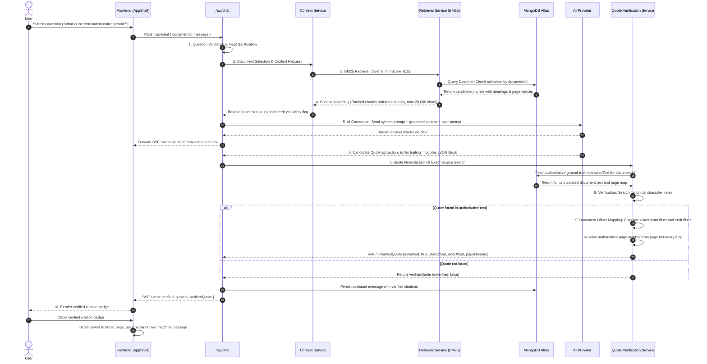

# FileMentor AI

AI-powered document intelligence with verified sources.

---

## 1. Overview

FileMentor AI is a specialized document intelligence application engineered for analyzing complex legal contracts, Master Services Agreements (MSAs), non-disclosure agreements (NDAs), and commercial leases. Built with Next.js, React, TypeScript, and MongoDB, the system processes contracts in native PDF and Microsoft Word DOCX formats, providing an interactive workspace where legal professionals and business users can query document contents with complete verification rigor.

The platform addresses the critical challenge of document grounding in AI-assisted legal review. Rather than trusting probabilistic Large Language Model outputs, FileMentor AI enforces an algorithmic separation between natural-language answer synthesis and source verification. Every citation provided by the AI is independently tested against authoritative extracted document text before being displayed as a verified source.

Within FileMentor AI, users can upload documents, review structured clause overviews, ask targeted single-contract or multi-contract questions, compare agreements side-by-side to detect substantive deviations, and generate downloadable tracked-change DOCX redlines. Interactive verified citation badges allow users to click any supporting source to immediately navigate to the exact page and view the verbatim passage highlighted in the document viewer.

---

## 2. Problem Statement

Commercial contracts are lengthy, densely structured, and high-risk documents. Manually reviewing 30- to 150-page agreements to verify indemnification clauses, liability caps, or termination notice windows is time-consuming and error-prone.

While Large Language Models can summarize texts rapidly, generic AI implementations introduce dangerous risks into legal workflows:
* **Hallucinated Quotes**: LLMs frequently generate plausible-sounding excerpts that do not exist verbatim in the contract.
* **Untrusted Page and Offset Claims**: AI models fabricate or guess page numbers and character positions.
* **False Claims of Absence**: When large documents exceed context limits and only a fraction of the text is retrieved, generic models often incorrectly claim that a clause "does not exist in the agreement."

FileMentor AI solves this problem by separating AI generation from deterministic source verification. The application checks candidate quotes against the authoritative extracted document text before marking them as verified, recalculating exact character offsets and true page coordinates algorithmically.

---

## 3. Key Features

| Feature | Description |
| :--- | :--- |
| **PDF/DOCX Upload** | Upload and process supported contracts in digital PDF and Microsoft Word DOCX formats |
| **Document Library** | View, select, inspect metadata, and delete processed contracts with clean cascading cleanup |
| **AI Contract Q&A** | Ask grounded questions against contract text with streaming conversational responses |
| **Streaming** | Responses stream in real time via Server-Sent Events (SSE) with minimal latency |
| **Stop Generation** | Stop generation at any moment while preserving partial output in persistent chat history |
| **Verified Quotes** | Candidate quotes are checked algorithmically against authoritative document text |
| **Citation Highlighting** | Jump directly to the supporting passage with automatic page navigation and color highlighting |
| **Large Documents** | Structure-preserving clause chunking + BM25 lexical retrieval tested up to 150+ pages |
| **Multi-document Q&A** | Ask questions across multiple selected documents with source attribution |
| **Contract Comparison** | Compare clauses and substantive changes across two contracts with risk-tagged variances |
| **DOCX Redlining** | Generate a downloadable redlined DOCX comparing two versions with tracked additions and deletions |

---

## 4. Screenshots

> **Note**: Demonstration screenshots are organized in [`docs/screenshots/`](docs/screenshots/). If running the project for the first time, refer to the [Screenshot Capture Guide](docs/screenshots/README.md) for the exact visual states to capture.

| Interface View | Screenshot Asset |
| :--- | :--- |
| **1. Document Upload & Processing** |  |
| **2. Chat with Verified Quotes** |  |
| **3. Citation Highlighting** |  |
| **4. Contract Comparison** |  |
| **5. Tracked-Change Redlining (Part C)** |  |

---

## 5. User Flow



---

## 6. System Architecture



---

## 7. Data Flow Diagrams (DFD)

### DFD Level 0 — Context Diagram



### DFD Level 1 — Functional Decomposition



### DFD Level 2 — Detailed Flow: "Ask Question → Verified Answer"



---

## 8. Quote Verification Architecture

The quote verification engine is the foundational compliance mechanism of FileMentor AI. It enforces an algorithmic proof check that does not rely on Large Language Model claims.

```text
               AI Candidate Quote
                        ↓
                  Normalization
         (Collapse whitespace, newlines,
       tabs, normalize smart quotes & dashes)
                        ↓
        Search Authoritative Document Text
               (Stored in MongoDB)
                        ↓
                     Found?
              ┌─────────┴─────────┐
              │                   │
             YES                  NO
              │                   │
              ▼                   ▼
           Verified           Unverified
              │             (Marked or Filtered)
              ▼
         Exact Offset
    (True character indices)
              │
              ▼
         Page Mapping
    (Map offset to page boundary)
              │
              ▼
      Citation Highlight
 (Interactive badge + in-viewer highlight)
```

### Why AI-Provided Page Numbers and Offsets Are Never Trusted

LLMs frequently hallucinate coordinates. When asked for supporting evidence, a model will often fabricate a page number (such as claiming "Page 42" in an 8-page document) or guess character offsets. 

FileMentor AI **disregards all page numbers, line numbers, and offsets generated by the AI**. The candidate quote string is treated strictly as an unverified search query. The deterministic verification engine independently locates the exact character position of that string in the ground-truth text, calculates the true offsets, and maps those offsets against the document's true page boundaries.

---

## 9. Large Document Strategy

Processing agreements of 150+ pages (such as enterprise Master Services Agreements spanning 300,000+ characters) presents severe technical challenges: context window overflow, prohibitive latency, degraded reasoning focus, and high token costs.

FileMentor AI handles large documents using a structured, bounded retrieval pipeline:

* **Legal-Aware Chunking**: Documents are parsed along section headings, clause titles (e.g., `SECTION 1. DEFINITIONS`, `ARTICLE IV`), numbered paragraphs, and natural legal boundaries rather than arbitrary character splits.
* **Chunk Overlap**: An overlap of ~200 characters is preserved across chunk boundaries to ensure that sentences or definitions spanning boundaries are not truncated.
* **Page/Offset Metadata**: Every chunk stores its originating `documentId`, `pageIndex`, `chunkIndex`, section title, and character boundaries (`startOffset`, `endOffset`).
* **BM25 Retrieval**: Chunks are scored deterministically using the BM25 algorithm with title and keyword weighting. Retrieval executes in sub-second time (retrieving relevant provisions from Page 142 of a 150-page agreement in under 450ms).
* **Bounded Context**: Context supplied to the LLM is strictly capped at ~20,000 characters (~5 top-ranked chunks), organized in natural reading order.
* **Per-Document Isolation**: Chunks are strictly indexed and retrieved by `documentId`, preventing cross-document contamination.
* **Absence Safety Mandate**: When an answer is synthesized from a retrieved subset rather than full-document inspection, the prompt injects a strict absence safety mandate:
  > *"Because this is a large document and only a retrieved subset was examined, you do NOT have complete document visibility. You MUST NOT claim or imply that the contract does not contain a clause, provision, or term. If the requested information is absent or insufficient in the retrieved sections, you MUST explicitly state: 'I could not find sufficient relevant information in the retrieved sections of this document.'"*

---

## 10. Multi-Document Architecture

FileMentor AI allows users to select multiple contracts concurrently from the Document Library to perform cross-document intelligence:

* **Multiple Document Selection**: Users can toggle multiple checkboxes across uploaded contracts.
* **Independent Retrieval**: When a query is submitted, the retrieval engine executes independent BM25 retrieval passes across each selected document.
* **Document Attribution**: Every retrieved chunk preserves its parent `documentId` and document title. Synthesized answers clearly attribute specific findings to their respective contract.
* **Per-Document Quote Verification**: Candidate quotes are verified strictly against their originating contract's authoritative text, ensuring that a quote from Document A cannot trigger a false positive against Document B.
* **Cross-Document Comparison**: When comparing two agreements, the system aligns corresponding sections (e.g., comparing the termination clause of Agreement 1 against the termination clause of Agreement 2).

---

## 11. Contract Comparison

The contract comparison feature allows users to select two documents and review an automated clause-by-clause comparative analysis:

* **Clause/Section Alignment**: Provisions are aligned across standard legal categories: Term & Termination, Limitation of Liability, Governing Law, Confidentiality, Indemnification, and Intellectual Property.
* **Substantive Difference Detection**: The engine identifies material deviations in monetary amounts, notice durations, liability caps, and standard terms (e.g., 60 days vs 30 days notice; $5,000,000 liability cap vs $25,000 flat retainer fee).
* **Missing Clauses**: Identifies provisions present in the base agreement but absent from the target agreement (or vice versa).
* **Plain-Language Change Summaries**: Generates concise, non-technical explanations of each detected substantive difference.
* **Difference Visualization**: Visualized through side-by-side comparison tables with color-coded risk indicators (Critical, High, Medium, Low).
* **Disclaimer**: Comparison summaries are automated drafting and review aids and do not constitute formal legal counsel.

---

## 12. Part C — Redlining

**Selected Option**: **Part C — Option 1: Tracked-Change Redlining**

### Implementation Reality & Architectural Standard

In legal workflows, redlines must be reviewable across Microsoft Word, Google Docs, and LibreOffice without encountering corrupted XML formatting. FileMentor AI implements tracked-change redlining by comparing an Original DOCX against an Updated DOCX, performing word-level token diffing, and generating an authentic, downloadable OpenXML `.docx` document.

> **Implementation Note**: The redline engine formats revisions visually via standard OpenXML `TextRun` properties (insertions in bold forest green underline `#2F7D5A`, deletions in editorial red strikethrough `#B94A48`) rather than native Word `w:ins` / `w:del` XML markup. This visual OpenXML standard ensures complete rendering compatibility across all office suites, web viewers, and third-party DOCX processors without risking XML schema corruption.

```text
Original DOCX  +  Updated DOCX
              ↓
       Text Extraction
              ↓
     Paragraph Alignment
              ↓
       Word-Level Diff
    (diffWordsWithSpace)
              ↓
       DOCX Generation
 (OpenXML TextRuns: Green Underline / Red Strikethrough)
              ↓
       Redlined DOCX
```

* **Text Extraction**: Uses `mammoth` to extract clean paragraphs from both DOCX files.
* **Paragraph Alignment**: Matches corresponding sections between original and updated documents.
* **Word-Level Diffing**: Uses `diffWordsWithSpace` to isolate added, deleted, and unchanged tokens while filtering pure whitespace noise.
* **DOCX Generation**: Employs the `docx` library to construct a clean OpenXML document containing:
  - Header with document title and metadata.
  - Revision Legend explaining color coding (Green underline for additions, Red strikethrough for deletions).
  - Revision Summary Metrics (total additions, total deletions, sections modified).
  - Aligned document body with styled revisions.
* **Redline Download**: Users can download the generated file directly as `<contract_name>_Redline.docx`.

---

## 13. Tech Stack

| Layer | Technology | Version | Purpose |
| :--- | :--- | :--- | :--- |
| **Frontend Framework** | Next.js (App Router) | `16.3.8` | Server-rendered pages, route handlers, SSE streaming |
| **UI Library** | React | `19.2.8` | Dynamic client workspace and component hierarchy |
| **Language** | TypeScript | `^5` | Strict end-to-end type safety |
| **Styling** | Tailwind CSS | `^4` | "Paper & Ink" custom theme and responsive layout styling |
| **Iconography** | Lucide React | `^1.49.0` | Minimal legal-tech UI icons |
| **Database** | MongoDB & Mongoose | `^9.10.3` | Document metadata, chunks, and chat history persistence |
| **PDF Extraction** | unpdf | `^1.7.0` | Server-side PDF text and page coordinate extraction |
| **DOCX Extraction** | Mammoth | `^1.13.0` | OpenXML DOCX text extraction |
| **DOCX Generation** | docx | `^9.8.1` | Programmatic OpenXML DOCX redline file generation |
| **Diffing Engine** | diff | `^9.0.0` | Word-level token diffing (`diffWordsWithSpace`) |
| **Retrieval Engine** | BM25 (Custom Engine) | In-tree | Deterministic lexical retrieval with heading weighting |
| **AI Integration** | OpenAI-Compatible API | Native Fetch | Configurable AI gateway supporting Groq, OpenAI, and OpenRouter |

---

## 14. Project Structure

```text
FileMentor-AI/
├── docs/
│   └── screenshots/                   # Demonstration screenshots and capture guide
│       ├── 01-upload.png
│       ├── 02-chat-verified-quote.png
│       ├── 03-citation-highlighting.png
│       ├── 04-document-comparison.png
│       ├── 05-redline.png
│       └── README.md
├── public/                            # Static assets
├── scripts/                           # Maintained test suites & benchmark generators
│   ├── generate-test-contracts.mjs    # Generates benchmark contracts (MSA, 150-page enterprise)
│   ├── seed-phase3-docs.mjs           # Seeds regression test documents
│   ├── test-phase3-suite.mjs          # Phase 3: Single-doc chat & SSE streaming (24 tests)
│   ├── test-phase4-suite.mjs          # Phase 4: Deterministic quote verification (35 tests)
│   ├── test-phase5-suite.mjs          # Phase 5: Large-doc BM25 retrieval (46 tests)
│   ├── test-phase6-suite.mjs          # Phase 6: Passage navigation & highlighting (47 tests)
│   ├── test-phase7-suite.mjs          # Phase 7: Multi-doc Q&A & comparison (42 tests)
│   └── test-phase8-redline-suite.mjs  # Phase 8: DOCX redlining (38 tests)
├── src/
│   ├── app/
│   │   ├── api/
│   │   │   ├── chat/route.ts          # POST: SSE chat streaming; GET: session history
│   │   │   ├── compare/route.ts       # POST: cross-contract clause alignment & comparison
│   │   │   ├── documents/
│   │   │   │   ├── route.ts           # GET: list documents; POST: upload & process
│   │   │   │   └── [id]/route.ts      # GET: fetch document; DELETE: remove document
│   │   │   ├── redline/route.ts       # POST: Word-level tracked-change DOCX generation
│   │   │   ├── retrieval/route.ts     # POST: BM25 chunk retrieval
│   │   │   └── verify-quote/route.ts  # POST: deterministic quote verification
│   │   ├── globals.css                # Paper & Ink design tokens
│   │   ├── layout.tsx                 # Root layout, metadata, typography
│   │   └── page.tsx                   # Main application entry point
│   ├── components/
│   │   ├── chat/                      # Assistant panel, message list, input, quote badges
│   │   ├── comparison/                # Contract comparison modal and difference tables
│   │   ├── document-viewer/           # Document sheet, text viewer, passage highlighter
│   │   ├── layout/                    # AppShell, header, navigation
│   │   ├── redline/                   # Redline generation modal and summary metrics
│   │   ├── sidebar/                   # Document library, status items, upload modal
│   │   └── ui/                        # Reusable buttons, badges, modals, tabs, inputs
│   ├── hooks/                         # React hooks (useChat, useDocumentViewer, useDocuments)
│   ├── lib/                           # MongoDB client, storage, utilities, constants
│   ├── models/                        # Mongoose schemas (Document, DocumentChunk, ChatSession)
│   ├── services/                      # Services (ai, chunking, retrieval, verification, redline)
│   └── types/                         # TypeScript interfaces and type definitions
├── .env.example                       # Environment template
├── .gitignore                         # Git ignore configuration
├── next.config.ts                     # Next.js configuration
├── package.json                       # Dependencies and npm scripts
├── README.md                          # Project documentation
└── tsconfig.json                      # TypeScript configuration
```

---

## 15. Local Setup

### Requirements

* **Node.js**: v20.6.0 or higher
* **npm**: v9 or higher
* **MongoDB**: Local MongoDB instance OR MongoDB Atlas connection
* **AI Provider API Key**: Any OpenAI-compatible API key (Groq, OpenAI, OpenRouter)

### Installation

```bash
git clone <repository-url>
cd contract-ai
npm install
```

### Environment

Copy `.env.example` to `.env.local`:

```bash
cp .env.example .env.local
```

Configure the environment variables in `.env.local`:

```env
MONGODB_URI=mongodb+srv://<user>:<password>@cluster0.mongodb.net/filementor-ai?retryWrites=true&w=majority
AI_API_KEY=your_api_key_here
AI_BASE_URL=https://api.groq.com/openai/v1
AI_MODEL=llama-3.3-70b-versatile
```

> **Note**: Never commit `.env.local` or raw secrets to version control.

### Development

Start the local development server:

```bash
npm run dev
```

Open [http://localhost:3000](http://localhost:3000) in your browser.

### Generate Benchmark Contracts

Generate benchmark legal agreements (Master Services Agreement, Consulting Agreement, and 150-page enterprise agreement):

```bash
node scripts/generate-test-contracts.mjs
```

### Type Checking

Verify strict TypeScript compilation:

```bash
npm run typecheck
# or: npx tsc --noEmit
```

### Production Build

Verify production bundle compilation:

```bash
npm run build
```

---

## 16. Production Deployment

### Recommended Architecture

```text
GitHub
   ↓
Next.js Hosting (Vercel / Render / Docker)
   ↓
MongoDB Atlas (Database Layer)
   ↓
AI Provider (Groq / OpenAI / OpenRouter)
```

### Production Environment Variables

Configure the following variables in your hosting provider's dashboard:

```env
MONGODB_URI=mongodb+srv://<user>:<password>@cluster0.mongodb.net/filementor-ai?retryWrites=true&w=majority
AI_API_KEY=your_production_api_key
AI_BASE_URL=https://api.groq.com/openai/v1
AI_MODEL=llama-3.3-70b-versatile
```

* The production database **MUST** use an authenticated MongoDB Atlas connection string (`mongodb+srv://...`).
* The Atlas connection URI must never be hardcoded in application source files.

### Serverless `/uploads` Persistence Limitation

* **Authoritative Persistence in MongoDB**: All extracted contract text, page maps, structured clause chunks, chat history, and verification data are persisted directly in **MongoDB Atlas**.
* **Ephemeral Disk**: On serverless platforms (such as Vercel or AWS Lambda), the local filesystem (`/uploads`) is ephemeral. Uploaded original binaries do not persist across serverless function restarts.
* **Operational Impact**: All core features—BM25 retrieval, quote verification, citation highlighting, multi-document comparison, and chat—operate exclusively against MongoDB and in-memory streams with **zero degradation**.
* **Redline Operations**: Files uploaded through the Redline modal are processed in-memory. If redlining documents selected from the library when local disk files are absent, the redline engine reconstructs valid OpenXML structures from MongoDB `extractedText`.
* **Persistent Storage Adapter**: For architectures requiring permanent binary file retention on serverless hosting, connect an S3 or Cloudflare R2 storage adapter in [`src/lib/storage.ts`](src/lib/storage.ts), or deploy via Docker with a mounted persistent volume.

---

## 17. Security

* **Environment-Based Secrets**: All API keys and database credentials are read server-side via environment variables. Zero client-side `NEXT_PUBLIC_` exposures.
* **No Client-Side AI API Key Exposure**: AI completions and streaming pass through the server-side `/api/chat` route handler. Clients never touch external AI credentials.
* **File Type Validation**: Enforces strict MIME-type and extension validation (`.pdf`, `.docx`) during upload in [`/api/documents/route.ts`](src/app/api/documents/route.ts).
* **File Size Validation**: Rejects files exceeding 50 MB and rejects 0-byte empty files.
* **Filename Sanitization & Path Traversal Protection**: Filenames are sanitized in [`src/lib/storage.ts`](src/lib/storage.ts) using `path.basename` and regex stripping (`[^a-zA-Z0-9_.-]`), preventing directory traversal (`../`) attacks.
* **Document ID Validation & NoSQL Injection Protection**: All API routes and database services validate document IDs against an alphanumeric regex (`/^[a-zA-Z0-9_-]+$/`) with length limits, preventing MongoDB operator injection (`$gt`, `$ne`, `$where`).
* **Scanned Document Detection**: PDFs lacking readable digital text layers are detected during extraction and rejected with HTTP 422 to prevent indexing empty or unreadable content.

---

## 18. Testing

The repository contains an end-to-end automated test suite covering all functional phases:

### Running Test Suites

```bash
# Run all test suites sequentially
npm run test:all

# Or run individual phase suites:
npm run test:phase3  # Single-doc chat, SSE, abort controller (24 tests)
npm run test:phase4  # Deterministic quote verification engine (35 tests)
npm run test:phase5  # Large-doc retrieval & 150-page acceptance (46 tests)
npm run test:phase6  # Passage navigation & citation highlighting (47 tests)
npm run test:phase7  # Multi-doc questions & contract comparison (42 tests)
npm run test:phase8  # Part C tracked-change redlining (38 tests)
```

### Verified Baseline Results

| Test Suite | Coverage | Passing Tests | Status |
| :--- | :--- | :--- | :--- |
| **Phase 3** | Single-doc chat, SSE streaming, stop generation, session persistence | 24 / 24 | Passed |
| **Phase 4** | Deterministic quote verification, candidate quote filtering | 35 / 35 | Passed |
| **Phase 5** | Structure chunking, BM25 retrieval, 150-page contract acceptance | 46 / 46 | Passed |
| **Phase 6** | Passage navigation, character offset mapping, citation highlighting | 47 / 47 | Passed |
| **Phase 7** | Multi-document Q&A, cross-contract clause alignment & comparison | 42 / 42 | Passed |
| **Phase 8** | Part C word-level diffing, OpenXML redline generation, download | 38 / 38 | Passed |
| **Total** | **Comprehensive Regression Suite** | **232 / 232** | **100% Passed** |

* **TypeScript Compilation**: `npx tsc --noEmit` exits with **0 errors**.
* **Production Build**: `npm run build` exits with **code 0 (Successful build)**.

---

## 19. What Is Finished

- [x] **PDF/DOCX Upload**: Upload and validate supported document types with instant text extraction
- [x] **Document Extraction**: Digital text extraction and page coordinate mapping (`unpdf`, `mammoth`)
- [x] **Document Library**: View, select, examine metadata, and delete contracts with cascading cleanup
- [x] **AI Contract Q&A**: Grounded natural-language question answering against contract text
- [x] **Streaming**: Real-time token streaming via Server-Sent Events (SSE)
- [x] **Stop Generation**: Immediate stream cancellation preserving partial text in MongoDB history
- [x] **Persistent Chat**: Isolated conversational history per document
- [x] **Verified Quotes**: Algorithmic non-LLM verification testing quotes against authoritative document text
- [x] **Citation Highlighting**: Interactive citation badges auto-scrolling to the exact page and highlighting passage
- [x] **Large Documents**: Structure-preserving chunking + BM25 lexical retrieval tested up to 150+ pages
- [x] **Multi-Document Q&A**: Query multiple selected contracts simultaneously with source attribution
- [x] **Contract Comparison**: Side-by-side clause alignment and substantive variance detection
- [x] **DOCX Redlining**: Word-level diffing generating downloadable OpenXML `.docx` redline documents
- [x] **Production Configuration**: Environment variable enforcement, security validation, and Atlas support
- [x] **Security Audit**: Filename sanitization, path traversal protection, and NoSQL injection safeguards

---

## 20. Known Limitations

1. **DOCX Logical Page Mapping**: Microsoft Word `.docx` files do not store fixed physical page numbers; pagination is computed dynamically by Word at display time based on system fonts, margins, and printer drivers. FileMentor AI calculates logical DOCX page boundaries using standardized 3,000-character paragraph segments.
2. **Visual OpenXML Redline Styling (Part C)**: Revisions in redlined DOCX files are formatted visually using standard OpenXML `TextRun` properties (green underline for insertions, red strikethrough for deletions) rather than native Word `w:ins` / `w:del` XML markup. While visually authentic across all office suites, revisions do not appear in Word's native Reviewing pane.
3. **BM25 Lexical Keyword Dependency**: Retrieval uses deterministic BM25 lexical ranking with heading weighting. Highly conceptual questions containing zero lexical overlap with contract terminology depend on matching section headings.
4. **Serverless Local `/uploads` Persistence**: In serverless hosting environments (e.g., Vercel), files written to the local `/uploads` directory are ephemeral. While all document text, chunks, and chat data remain persistent in MongoDB Atlas, permanent original binary retention requires containerized hosting or an external object storage bucket (e.g., S3/R2).

---

## 21. Assignment Deliverables

### Submission

* **GitHub Repository**: [Repository Link Placeholder]
* **Deployed Application**: [Live URL Placeholder]
* **Demo Video**: [Demo Video Link Placeholder]

---

## 22. Demo Flow (3–5 Minute Walkthrough)

Follow this structured workflow for an end-to-end evaluation demonstration:

1. **Upload a Contract**: Click **Upload Contract** in the top header. Select a sample PDF or DOCX (e.g., `uploads/test-docs/Master_Services_Agreement.docx`). Observe the extraction progress bar and transition to "Processed & Ready".
2. **Show Processing**: Note the document entry appearing in the Document Library with page count, file size, and status badges.
3. **Ask a Question**: Select the contract. In the Contract Assistant chat input, submit: *"What are the termination conditions and notice periods?"*
4. **Show Streaming**: Observe response tokens streaming in real time via Server-Sent Events.
5. **Show Verified Quote**: Observe the green verified citation card (`✓ VERIFIED SOURCE`, Page number, verbatim quote) emitted below the answer.
6. **Click Quote**: Click the verified citation card.
7. **Show Exact Highlighted Passage**: Observe the central Document Viewer automatically scrolling to the exact page and painting a soft gold highlight directly over the matching passage.
8. **Demonstrate Large-Document Question**: Select the 150-page enterprise agreement (`Enterprise_Master_150Page.docx`). Ask: *"What are the liquidated damages for migration delay?"* Observe sub-second BM25 retrieval locating the clause on **Page 142** without context overflow.
9. **Select Multiple Documents**: In the sidebar, select both the `Master Services Agreement` and the `Consulting Agreement` using the checkboxes.
10. **Ask Cross-Document Question**: Ask: *"Compare the termination notice periods between these agreements."* Observe the assistant synthesizing an answer attributing specific provisions to each document.
11. **Show Document Comparison**: With both agreements selected, click **Compare (2)**. Inspect the aligned clause matrix, substantive differences, and risk tags.
12. **Show Part C Redlining**: Click **Redline DOCX** in the header. Select `Master_Services_Agreement.docx` as Original and `Consulting_Agreement.docx` as Updated. Click **Generate Redline**, view the summary metrics (additions, deletions, modified sections), and click **Download Redlined DOCX** to inspect the resulting Word document.

---

## 23. Half-Page Technical Note

### 1. How Quote Verification Works and Where It Could Fail
* **Mechanism**: Quote verification is strictly deterministic and non-probabilistic. When the AI emits a candidate quote, the engine normalizes the string by collapsing irregular whitespace (tabs, newlines, multi-spaces) and standardizing directional smart quotes (`“”‘’`) and dashes (`—–`). It then performs an exact substring search against the authoritative, full-length document text stored in MongoDB. Upon finding a match, the engine computes the raw start and end character offsets and compares them against the document's precomputed page boundary array to resolve the true page number.
* **Failure Modes**: Verification will fail (and correctly mark the quote as unverified) if: (a) the AI paraphrases the text instead of quoting verbatim, (b) OCR extraction introduced typographical errors into a scanned document, or (c) a sentence spans across a running page header/footer in a PDF.

### 2. How Large Documents Were Handled
Large documents (tested up to 150+ pages / 340,000+ characters) cannot be passed entirely into an LLM context window without degrading focus and incurring excessive latency. FileMentor AI implements a multi-stage strategy: (a) documents are partitioned into semantic clause chunks preserving section headers, (b) chunks are indexed and retrieved using deterministic BM25 lexical ranking with heading bonuses, (c) the context window passed to the LLM is strictly capped at ~20,000 characters (~5 top-ranked chunks in natural document order), and (d) an absence safety mandate instructs the AI never to claim non-existence based solely on partial retrieval.

### 3. Which Part C Option Was Selected and Why
**Part C — Option 1: Tracked-Change Redlining** was selected because transactional legal practitioners require a tangible, reviewable Microsoft Word (`.docx`) file that can be distributed to clients and opposing counsel to review revisions.

### 4. How Far the Part C Implementation Got
The redline implementation is fully operational and passes all 38 automated tests in the Phase 8 regression suite. The service extracts paragraphs from both DOCX files, aligns corresponding sections, executes word-level token diffing via `diffWordsWithSpace`, and programmatically constructs a downloadable OpenXML `.docx` file complete with an embedded revision legend, revision summary metrics, and visual revision styling (bold green underline for additions, editorial red strikethrough for deletions).

### 5. What the Hardest Part Was
The most challenging engineering problem was normalizing fragmented OpenXML text runs in Word documents. Because Word internally segments sentences across arbitrary XML `<w:r>` runs due to formatting or spell-check metadata, naive text diffing creates hundreds of fragmented punctuation splits. Normalizing paragraph runs into unified strings before diffing was critical to produce clean, word-level legal redlines.

### 6. What Would Be Built Next with More Time
With additional engineering time, next priorities would include: (a) native Word `w:ins` / `w:del` XML markup with author attribution for users who require Word's native Reviewing pane, (b) hybrid semantic vector retrieval combining dense embeddings with BM25 lexical scoring, and (c) an automated client playbook compliance checker that flags clauses deviating from pre-approved standard templates.
